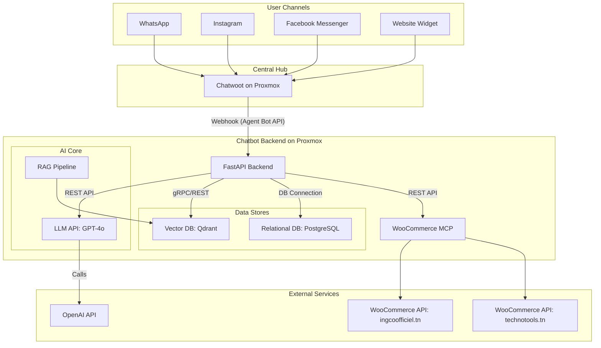

# Product Requirements Document: Intelligent Omnichannel Chatbot (MVP)

> **Project:** Intelligent Omnichannel Business Chatbot 
> **Version:** 1.0 (MVP for Phase 1)
> **Status:** Final
> **Author:** Senior AI Architect & Product Manager
> **Date:** March 12, 2026

---

## 1. Project Overview

### 1.1. Vision
To develop an intelligent, omnichannel chatbot that serves as the primary customer interaction point for a multi-store Tunisian e-commerce platform. The MVP will establish a single, scalable bot instance capable of handling customer queries across multiple channels and stores, understanding local dialects, and seamlessly integrating with existing business operations.

### 1.2. MVP Scope
This document defines the requirements for the Minimum Viable Product (MVP), corresponding to **Phase 1** of the project. The goal is to deliver a functional, production-ready chatbot with core capabilities within a 3-4 month timeframe. The focus is on establishing the foundational architecture and delivering immediate value by automating common customer inquiries. Advanced features like model fine-tuning and active learning are deferred to Phase 2.

---

## 2. Problem Statement

E-commerce businesses on the platform face significant operational challenges in managing customer support. Agents are overwhelmed by a high volume of repetitive queries coming from multiple channels (WhatsApp, social media, websites). This leads to slow response times, inconsistent answers, and an inability to provide 24/7 support. Furthermore, a significant portion of customer communication happens in Tunisian Darija, a dialect poorly supported by standard AI tools, creating a major comprehension barrier. There is a clear need for an automated, scalable, and linguistically capable solution to enhance customer service and operational efficiency.

---

## 3. Business Objectives

The MVP aims to achieve the following business goals:
- **Increase Customer Support Automation:** Automate responses to frequently asked questions to reduce the load on human agents.
- **Improve Customer Responsiveness:** Provide instant, 24/7 answers to customer queries, improving overall customer satisfaction.
- **Centralize Customer Interactions:** Unify customer conversations from four different channels into a single, manageable system (Chatwoot).
- **Validate Core Technology:** Prove the viability of the proposed technical architecture, particularly the RAG pipeline for a multi-store, multilingual context.

---

## 4. Functional Requirements

| ID | Requirement | Description |
|---|---|---|
| **FR-01** | **Omnichannel Message Reception** | The system must receive messages from four channels: WhatsApp, Instagram, Facebook Messenger, and a website chat widget, via a central Chatwoot hub. |
| **FR-02** | **Multi-Store Context Awareness** | The chatbot must identify the store context for each incoming conversation (e.g., `ingcoofficiel.tn` vs. `technotools.tn`) based on the Chatwoot inbox. |
| **FR-03** | **Multilingual Understanding** | The chatbot must comprehend user queries written in Tunisian Darija, French, and Standard Arabic, including messages that mix languages. |
| **FR-04** | **Language Mirroring** | The chatbot must respond to the user in the same language and dialect they used for their query. |
| **FR-05** | **Knowledge-Based Answering (RAG)** | The chatbot must answer questions by retrieving information from a knowledge base containing product specifications, store policies, and other static documents. |
| **FR-06** | **Live Product Information** | The chatbot must be able to query WooCommerce in real-time to provide up-to-the-minute product price and stock availability. |
| **FR-07** | **Draft Order Creation** | The chatbot must be able to create a draft order in WooCommerce on behalf of the customer. The order must be saved with a `pending` status for human review. |
| **FR-08** | **Human Agent Escalation** | The chatbot must provide a clear and simple mechanism for the user to request a transfer to a human agent at any point in the conversation. |
| **FR-09** | **PII Masking** | The system must detect and mask Personally Identifiable Information (PII) like names, phone numbers, and addresses before sending conversation content to any external LLM API. |

---

## 5. Non-Functional Requirements

| ID | Requirement | Metric / Target |
|---|---|---|
| **NFR-01** | **Performance** | End-to-end response latency must be **< 2 seconds** for 90% of queries. |
| **NFR-02** | **Accuracy** | Intent recognition and information retrieval accuracy must be **> 80%** on a set of predefined standard test scenarios. |
| **NFR-03** | **Availability** | The chatbot service must maintain **99.9% uptime** (24/7 availability). |
| **NFR-04** | **Scalability** | The architecture must be horizontally scalable to support additional stores in the future with minimal configuration changes and no code changes. |
| **NFR-05** | **Data Privacy** | The system must be compliant with Tunisian data protection law (Loi 2004-63), ensuring data residency and secure handling of PII. |

---

## 6. System Architecture Diagram

---

## 7. AI Components

### 7.1. LLM (Phase 1)
- **Model:** `GPT-4o` (via OpenAI API).
- **Rationale:** Provides the best out-of-the-box performance for understanding Tunisian Darija without initial fine-tuning, enabling a rapid launch.
- **Usage:** The LLM is the core reasoning engine. It generates responses based on the user's query and the context retrieved by the RAG pipeline. A system prompt will instruct it to mirror the user's language.

### 7.2. Retrieval-Augmented Generation (RAG)
- **Framework:** `LlamaIndex`.
- **Rationale:** Purpose-built for RAG, offering robust tools for document chunking, indexing, and retrieval, including support for the multi-store namespace strategy.
- **Flow:**
    1. User query is converted into an embedding.
    2. The embedding is used to search the Vector DB for relevant document chunks.
    3. The retrieved chunks are passed to the LLM along with the original query to generate a grounded, accurate response.

### 7.3. Embeddings
- **Model:** `multilingual-e5-large`.
- **Rationale:** A powerful multilingual model that can map queries and documents from Tunisian Darija, French, and Arabic into a shared vector space. This allows for effective cross-lingual retrieval (e.g., a Darija query retrieving a French document).

---

## 8. Technology Stack

| Component | Technology | Rationale |
|---|---|---|
| **Backend Framework** | Python 3.11+ with FastAPI | Modern, async-first, high-performance framework ideal for I/O-bound tasks like handling webhooks and API calls. |
| **Omnichannel Hub** | Chatwoot (Self-Hosted) | Open-source, provides a unified inbox for all channels and a native Agent Bot API for integration. |
| **Vector Database** | Qdrant | High-performance vector search engine with native support for collections and namespaces, perfect for the multi-store architecture. |
| **Relational Database** | PostgreSQL | Robust, open-source database for storing conversation logs, user data, and application state. |
| **WooCommerce Integration** | Custom Python MCP | A dedicated Model-Context-Protocol layer to securely interact with WooCommerce APIs, enforcing a restricted, read-heavy toolset. |
| **Deployment** | Docker Compose on Proxmox | Containerization simplifies deployment, management, and scaling of all self-hosted components. |

---

## 9. Data Sources

| Data Source | Type | Indexing Method | Update Mechanism |
|---|---|---|---|
| **Store Policies, Guides** | Static Documents (PDF, .docx) | Hierarchical chunking, indexed into a `shared` namespace in Qdrant. | Manual re-indexing upon update. |
| **Product Specifications** | Product Data | Chunked and indexed into store-specific namespaces in Qdrant (e.g., `ingcoofficiel`). | Webhook from WooCommerce on product update. |
| **Product Price & Stock** | Volatile Product Data | **Not indexed.** | Fetched in real-time from WooCommerce API via the MCP. |

---

## 10. Development Phases (MVP Focus)

The MVP will be developed over a 3-4 month period, broken down into the following key milestones:

| Phase | Duration | Key Activities | Deliverable |
|---|---|---|---|
| **1. Infrastructure Setup** | 3 Weeks | - Deploy Proxmox VM/container.  - Install and configure self-hosted Chatwoot.  - Set up PostgreSQL and Qdrant instances.  - Configure Nginx reverse proxy with SSL. | A stable, running instance of Chatwoot connected to all four channels. |
| **2. Backend & RAG Pipeline** | 5 Weeks | - Develop FastAPI backend with webhook endpoint for Chatwoot.  - Implement the RAG pipeline using LlamaIndex.  - Set up the document ingestion process for static knowledge.  - Integrate the `multilingual-e5-large` embedding model. | A backend capable of retrieving relevant information from the vector database based on a query. |
| **3. Core Logic & LLM Integration** | 4 Weeks | - Integrate the GPT-4o API.  - Implement the multi-store context logic.  - Develop the PII masking layer.  - Implement the WooCommerce MCP for reading product data and creating draft orders. | A chatbot that can understand queries, fetch data, and generate contextual responses. |
| **4. Integration & Testing** | 3 Weeks | - Full end-to-end integration of all components.  - Develop a test suite with 50+ standard scenarios.  - Conduct user acceptance testing (UAT) with project supervisors/agents.  - Bug fixing and performance tuning. | A fully functional and tested MVP system ready for demonstration and pilot use. |

---

## 11. Risks and Mitigation

| Risk | Likelihood | Impact | Mitigation Strategy |
|---|---|---|---|
| **Poor Darija Understanding** | Medium | High | **Mitigation:** While GPT-4o is the best starting point, its Darija is not perfect. The system will have a clear escalation path to a human agent. Phase 2 is explicitly designed to address this by fine-tuning a model on real Tunisian conversation data. |
| **Data Access Issues** | Low | High | **Mitigation:** Confirm API access for WooCommerce and channel providers (Meta) early in the project. Develop with mock data and interfaces initially to de-risk development from API availability. |
| **Infrastructure Complexity** | Medium | Medium | **Mitigation:** Use Docker Compose to standardize the deployment of self-hosted components. Maintain detailed documentation for the Proxmox setup. Start with a single-node deployment and scale only if necessary. |
| **Scope Creep** | High | High | **Mitigation:** Strictly adhere to the MVP feature set defined in this PRD. All new feature requests must be deferred to the post-MVP backlog for consideration in Phase 2 or later. |

---

## 12. Success Metrics

The success of the MVP will be measured against the following key performance indicators (KPIs):

| Metric | Target (at end of Phase 1) | How to Measure |
|---|---|---|
| **Automation Rate** | **> 40%** of conversations handled without human escalation. | (Total Conversations - Escalated Conversations) / Total Conversations. Measured in Chatwoot analytics. |
| **Response Time** | Median response time **< 2 seconds**. | Measured from the time the backend receives the webhook to the time it sends the response to Chatwoot. Logged in PostgreSQL. |
| **Task Completion Rate** | **> 70%** success rate for core tasks (product search, price check, draft order creation). | Measured via automated testing and analysis of conversation logs for successful outcomes. |
| **User Satisfaction (CSAT)** | Establish a baseline CSAT score via Chatwoot's built-in survey feature. | The goal is to gather data, not hit a specific target in the MVP. A positive trend is desired. |
